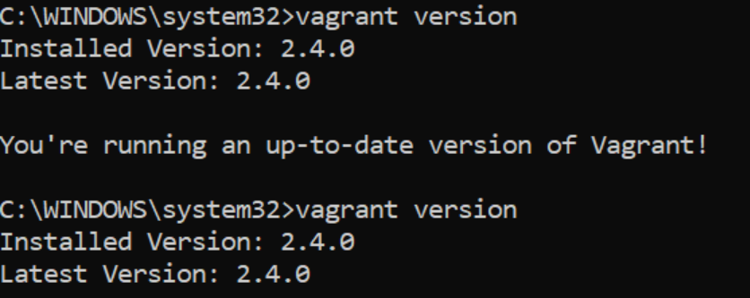
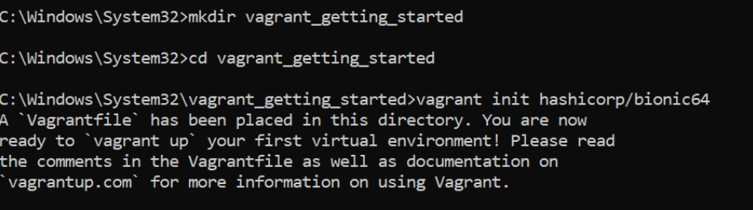
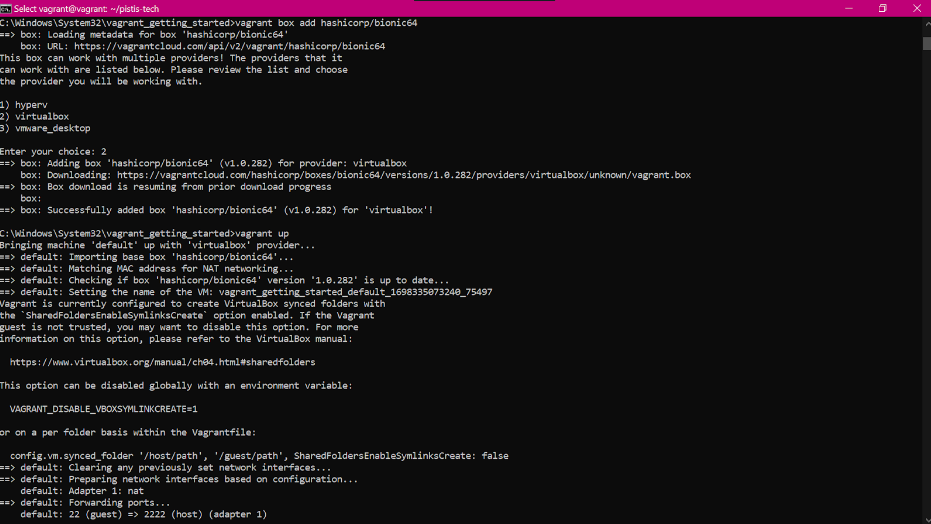
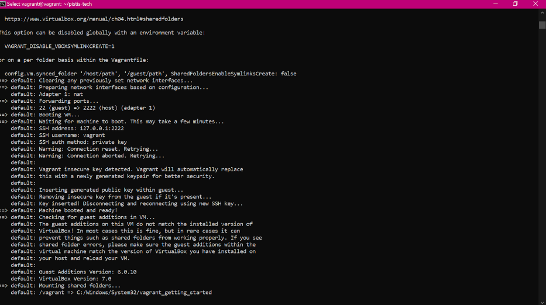
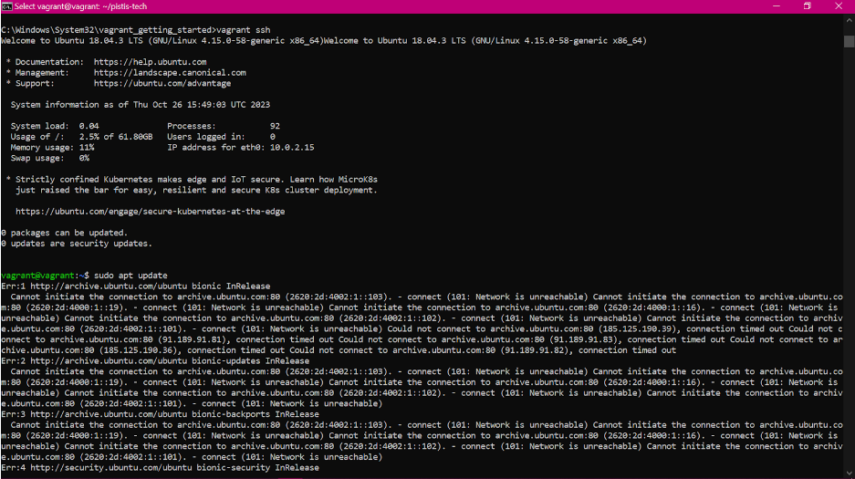
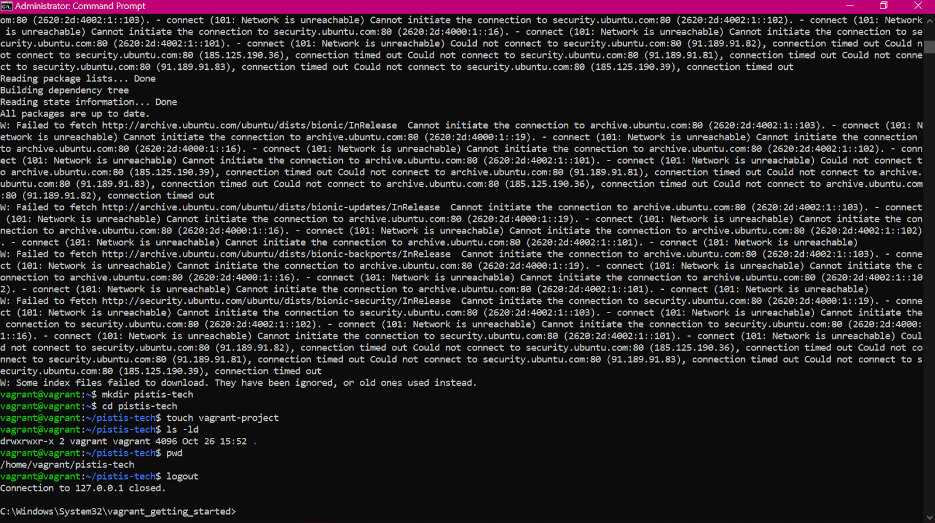
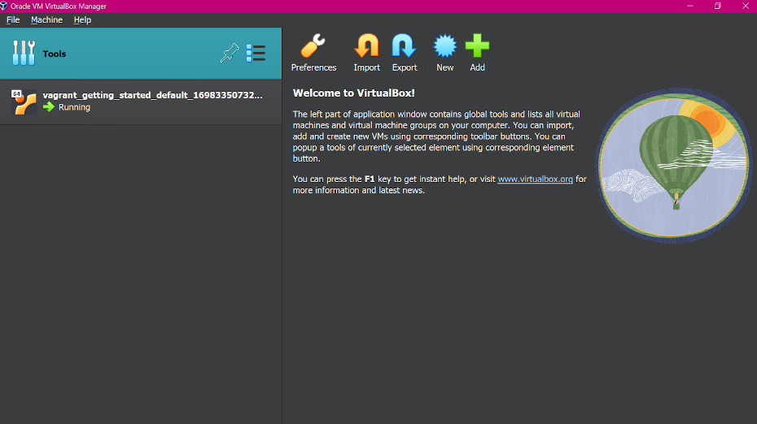

# VAGRANT INSTALLATION AND SETUP

The following steps were taken for the installation and setup of vagrant on Windows: 

#### Install vagrant
Installed and configured Vagrant on Windows operating system from the official site https://developer.hashicorp.com/vagrant/downloads.

#### Verify the Installation
Verified the installation by checking the version in a command line interface using the following command: `vagrant version`



#### Create a directory
Created a directory for the new project to work on, moved into it:
```markdown
mkdir vagrant_getting_started
cd vagrant_getting_started
```



#### Initialize the project
Initialized the directory or project to create a ‘Vagrantfile’ with a box (that’ll be used as a base for the project) by specifying the `hashicorp/bionic64` box using the  Vagrant `vagrant init` built-in command: `vagrant init hashicorp/bionic64` 

#### Use a Box
I configured the project to use the box as a base (by doing so explicitly i.e., editing the Vagrantfile in a text editor and replacing the contents with:
```Vagrantfile
Vagrant.configure("2") do |config|
    config.vm.box = "hashicorp/bionic64"
end
```
Or, simply initializing it with the `vagrant init` command done above). If the box was not added before, Vagrant will automatically download and add the box when it is run: `vagrant box add hashicorp/bionic64`. 
Note: I ensured the name I used to add the box when initializing (i.e., `vagrant init hashicorp/bionic64`)  matches that when configuring the project to use the box as a base (i.e., `vagrant box add hashicorp/bionic64`)

#### Bring up a virtual machine
After, I booted my first Vagrant environment which set up a virtual machine instance running Ubuntu (based on my config) using the command: `vagrant up`
Note: I already have a VirtualBox VM installed on my Windows OS so I selected it as a provider to run Ubuntu. also, this command downloads the specified bse box if not already downloaded to create the vm instance with your vm provider.




To prove the virtual machine (Ubuntu) was running, I SSHed into it: `vagrant ssh`



#### Explore the Virtual Machine environment
To confirm installation of the virtual machine, I explored and ran the commands in the image below, performed any necessary configurations. 

#### Stop and Destroy the Vagrant Virtual Machine
And finally terminated the SSH session once done: `logout`. You can use the following commands `vagrant halt` to gracefully shutdown the vm or `vagrant destroy` to completely destroy the vm, freeing up resources



#### Result
This is what my VirtualBox VM GUI looks like after configuring and setting up a new project in Vagrant and choosing the VirtualBox as a provider to run Ubuntu for the Vagrantfile.

