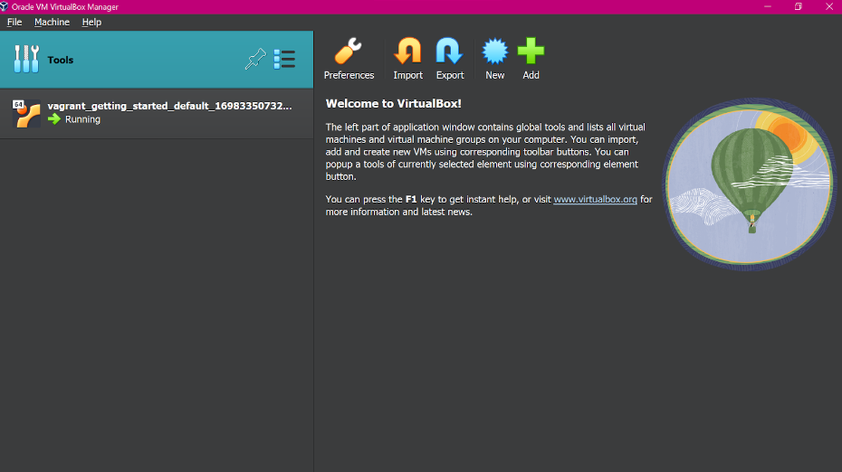

# VIRTUAL MACHINES RESEARCH PROJECT

## 1.VIRTUALIZATION TECHNOLOGIES

### Virtualization technologies commonly used in DevOps practices include:

1. **Hypervisors:** Hypervisors are software or hardware platforms that allow multiple virtual machines (VMs) to run on a single physical server. They provide the foundation for virtualization by managing the allocation of resources, such as CPU, memory, and storage, to the VMs.

2. **Containers:** Containers provide lightweight virtualization at the operating system level. They encapsulate an application and its dependencies into a single, portable package that can run consistently across different environments. Popular containerization technologies include Docker and Kubernetes.

3. **Infrastructure as Code (IaC):** IaC tools, such as Terraform and CloudFormation, enable the provisioning and management of virtualized infrastructure resources through code. This allows for the automation and version control of infrastructure deployments, making it easier to replicate and scale environments.

4. **Virtual Networks:** Virtual networks enable the creation of isolated network environments within a physical network infrastructure. Technologies like Virtual Private Cloud (VPC) and Software-Defined Networking (SDN) provide the ability to define and manage virtual network configurations programmatically.

5. **Virtual Appliances:** Virtual appliances are pre-configured software solutions packaged as virtual machines. They provide specific functionalities, such as firewalls, load balancers, or databases, that can be easily deployed and managed within virtualized environments.

These virtualization technologies enable DevOps teams to create, deploy, and manage environments more efficiently, leading to faster development cycles, improved scalability, and better resource utilization.

### Containerization (e.g., Docker) and traditional virtualization (e.g., VMware) differ in several aspects in DevOps environments. 

**Containerization** allows for the running of multiple operating systems in a single instance, making it suitable for running multiple processes simultaneously. It enables the isolation of individual application components, facilitating rapid updates and closely aligning with microservices architecture. Containers are portable, allowing the same code to run on any device, making them beneficial for achieving application portability and scalability.

On the other hand, **traditional virtualization** involves running multiple virtual machines on a physical machine. It is commonly used in cloud environments and excels at efficiently utilizing hardware resources. Virtual machines provide the ability to run different operating systems and environments on the same host.

In summary, containerization is ideal for running multiple processes simultaneously, achieving application portability, and enabling rapid updates, while traditional virtualization is well-suited for efficiently utilizing hardware resources and running different operating systems and environments.

## 2. PERFORMANCE OPTIMIZATION

### To optimize virtual machine (VM) performance for different workloads in a DevOps context, several strategies can be employed:

1. **Right-sizing:** Analyze the resource requirements of each workload and allocate the appropriate amount of CPU, memory, and storage to the VM. Avoid over-allocating resources, as it can lead to resource contention and performance degradation.

2. **Performance Monitoring:** Continuously monitor the performance metrics of VMs using tools like monitoring agents or performance management solutions. Identify bottlenecks and optimize resource allocation accordingly.

3. **Resource Pooling:** Implement resource pooling techniques such as load balancing and workload distribution to evenly distribute the workload across multiple VMs. This helps prevent resource congestion and ensures optimal performance.

4. **Storage Optimization:** Use techniques like thin provisioning and data deduplication to optimize storage utilization. Also, leverage storage technologies such as solid-state drives (SSDs) for improved I/O performance.

5. **Network Optimization:** Configure the network settings of VMs to ensure efficient communication and minimize latency. Use techniques like network segmentation and Quality of Service (QoS) to prioritize traffic and enhance performance.

6. **VM Optimization:** Regularly update VM software, firmware, and drivers to take advantage of performance improvements and bug fixes. Disable unnecessary services and applications within VMs to reduce resource consumption and improve performance.

7. **Automation and Orchestration:** Utilize automation and orchestration tools to dynamically adjust VM resources based on workload demands. This ensures optimal performance by scaling resources up or down as needed.

By implementing these strategies, DevOps teams can optimize VM performance and ensure that workloads run smoothly and efficiently.

### Resource allocation and management in virtualized environments is crucial for ensuring optimal performance and efficient utilization of resources. Here are some best practices:

1. **Right-sizing:** Allocate resources based on the workload requirements to avoid over-provisioning or under-provisioning. Monitor resource usage and adjust allocations accordingly.

2. **Performance Monitoring:** Continuously monitor resource utilization, such as CPU, memory, disk, and network, to identify bottlenecks and optimize resource allocation.

3. **Resource Pooling:** Consolidate resources into resource pools to enable efficient allocation and sharing of resources among multiple virtual machines (VMs).

4. **Storage Optimization:** Implement storage optimization techniques like thin provisioning, deduplication, and compression to reduce storage costs and improve performance.

5. **Network Optimization:** Configure networking components, such as virtual switches and network adapters, to optimize network performance and ensure smooth communication between VMs.

6. **VM Optimization:** Regularly update and patch VMs to ensure they are running efficiently. Remove unnecessary services and applications to free up resources.

7. **Automation and Orchestration:** Implement automation tools and frameworks to streamline resource allocation and management processes. Use orchestration tools to automate resource provisioning, scaling, and deprovisioning.

By following these best practices, organizations can optimize resource allocation, improve performance, and achieve cost savings in virtualized environments.

## 3. INFRASTRUCTURE AS CODE (IaC)

### The adoption of Infrastructure as Code (IaC) tools like Terraform has a significant impact on the provisioning and management of virtual machines. With IaC tools, such as Terraform, organizations can define and provision virtual machines programmatically using code. This eliminates the need for manual setup and configuration, making the process faster, more efficient, and less error-prone.

Terraform allows developers to define infrastructure requirements in declarative code, specifying the desired state of the virtual machines and their dependencies. It then automatically provisions and configures the virtual machines to match the desired state. This approach ensures consistency and repeatability in the infrastructure setup, making it easier to manage and reproduce environments.

Furthermore, IaC tools like Terraform enable version control, allowing teams to track and manage changes to the infrastructure code over time. This improves collaboration, facilitates auditing, and provides a clear history of infrastructure modifications.

Overall, the adoption of IaC tools like Terraform streamlines the provisioning and management of virtual machines by automating the process, improving consistency, and enabling version control. 

### Using Infrastructure as Code (IaC) for VM deployments in a DevOps pipeline offers several benefits, but it also poses certain challenges. 

**Benefits of using IaC for VM deployments in a DevOps pipeline include:**
1. **Automation and Consistency**: IaC enables the automation of VM provisioning and configuration, reducing manual effort and ensuring consistent deployments.
2. **Version Control**: IaC allows versioning and tracking changes to infrastructure configurations, facilitating easy rollback and eliminating configuration drift.
3. **Reproducibility**: IaC ensures that VM deployments are reproducible across different environments, reducing the risk of inconsistencies between development, testing, and production environments.
4. **Scalability**: IaC makes it easier to scale VM deployments by defining infrastructure configurations as code and allowing easy replication.
5. **Collaboration**: IaC promotes collaboration between development and operations teams, as infrastructure configurations are defined and managed as code.

**Challenges of using IaC for VM deployments in a DevOps pipeline include:**
1. **Learning Curve**: Adopting IaC tools and practices may require training and upskilling for the team members who are not familiar with them.
2. **Complexity**: Managing complex infrastructure configurations as code can be challenging, especially for larger deployments and when dealing with interconnected services.
3. **Testing and Validation**: Ensuring the correctness of infrastructure code and validating its impact on VM deployments may require additional testing and validation processes.
4. **Tool Selection**: Choosing the right IaC tool that aligns with the team's requirements and infrastructure needs can be a challenge.
5. **Security and Compliance**: Proper security measures and compliance requirements need to be considered and implemented when using IaC for VM deployments.

Despite these challenges, the benefits of using IaC for VM deployments in a DevOps pipeline often outweigh the challenges, leading to improved efficiency, scalability, and consistency in the deployment process.

## 4. VM BACKUP AND RECOVERY

### In a DevOps environment, several strategies and tools can be employed for automated backup and recovery of virtual machines. Here are some key strategies and tools:

1. **Integration with CI/CD Pipeline**: Integrate the backup and recovery process seamlessly into the DevOps CI/CD pipeline to ensure backups are not forgotten or outdated.

2. **Automation**: Utilize automation tools to schedule and perform regular backups of virtual machines. This helps ensure consistency, accuracy, and efficiency in the backup process.

3. **Cloud Backup and Restore**: Leverage major cloud platforms that offer backup and restore capabilities. This allows for easy and secure storage of backup data, as well as quick restoration of virtual machines in case of system failures or disasters.

4. **Disaster Recovery Planning**: Incorporate disaster recovery planning into the DevOps workflow. By treating the recovery process as an application deployment process, teams can use their deployment knowledge and experience to simplify and expedite the recovery process.

5. **Virtualization Technologies**: Make use of virtualization technologies, such as storage area networking and software-defined networking, to enable quick scaling up and down of virtual machines as needed.

Overall, the key is to carefully plan and implement automated backup and recovery strategies that align with the specific needs and requirements of the DevOps environment.

### How backup and recovery fits into a continuous integration/continuous deployment (CI/CD) workflow

Incorporating backup and recovery in a CI/CD workflow is important to ensure data protection and minimize the risk of data loss due to technical errors or other issues. By automating backup operations using Infrastructure as Code (IaC) tools like AWS CloudFormation and AWS Backup, organizations can standardize and scale their data protection strategy. 

The use of modern software development practices such as Continuous Integration (CI) can also help automate backup operations at scale. This includes using tools like AWS CodeCommit, AWS CodeBuild, AWS CodeDeploy, and AWS CodePipeline to implement a cloud data protection strategy. By integrating backup and recovery into the CI/CD process, organizations can improve workflow, speed up release cycles, and minimize the time and costs associated with repairing and restoring repositories to full working ability. 

## 5. SECURITY AND COMPLIANCE

### Security considerations specific to virtual machine (VM) deployments in DevOps include:

1. **Automated Security Measures**: It is important to prioritize the deployment of automated tools to identify potential threats, problematic or vulnerable code, and issues with processes. Security processes like code reviews, configuration management, vulnerability assessment, and access management should be automated. Implementing security as code by treating security infrastructure and policies as code can also help ensure consistency and automate deployment.

2. **DevSecOps Integration**: Incorporating security measures into every part of the DevOps lifecycle, known as DevSecOps, is crucial. This involves integrating security practices throughout the development, testing, deployment, and monitoring stages. It helps address the speed at which code is released and the resistance to introducing security measures in DevOps environments.

3. **Cloud Security**: DevOps environments often rely on cloud deployments, so it is essential to consider cloud security best practices. This includes using secure cloud configurations, implementing strong access controls, encrypting data, and regularly monitoring and auditing cloud resources.

4. **Container Security**: Many DevOps environments use containers, which come with their own security considerations. It is important to ensure that containers are properly configured, regularly updated with security patches, and scanned for vulnerabilities. Implementing container security tools and practices can help mitigate risks.

5. **Secrets and Access Controls**: Proper management of secrets and privileged access controls is crucial. Implementing secure storage and management of secrets, using strong authentication and authorization mechanisms, and regularly reviewing and rotating access credentials can help prevent unauthorized access to VMs.

By addressing these security considerations, organizations can enhance the security of their virtual machine deployments in DevOps environments and mitigate potential risks.

### To audit virtual machine environments for compliance with industry standards and regulations, organizations can follow the following steps:

1. **Define Compliance Requirements**: Identify the specific industry standards and regulations that apply to your organization's virtual machine environments. These may include security standards like ISO 27001, regulatory frameworks like GDPR, or industry-specific guidelines.

2. **Conduct Risk Assessment**: Assess the risks associated with your virtual machine environments, considering factors such as data security, access controls, and system availability. Identify potential vulnerabilities and prioritize them based on their impact and likelihood.

3. **Implement Controls**: Implement controls and best practices to address the identified risks. This may include configuring secure network settings, applying patches and updates, encrypting data, and establishing access controls and user permissions.

4. **Regular Monitoring**: Continuously monitor your virtual machine environments to ensure compliance with the defined standards and regulations. Use monitoring tools and techniques to detect and address any security breaches or non-compliance issues promptly.

5. **Perform Audits**: Conduct regular audits to assess the compliance of your virtual machine environments. This can be done internally or with the help of external auditors or information security professionals. Audits may involve reviewing configuration settings, access logs, system documentation, and security measures.

6. **Document and Report**: Maintain comprehensive documentation of your compliance efforts, including policies, procedures, audit reports, and evidence of controls. Report on compliance status to relevant stakeholders, such as management, regulatory bodies, or clients, as required.

7. **Remediation and Continuous Improvement**: Address any identified non-compliance issues promptly and develop a plan for remediation. Continuously improve your virtual machine environments' compliance posture by implementing lessons learned from audits and staying up to date with evolving industry standards and regulations.

It is also recommended to leverage tools and technologies specifically designed for virtual machine compliance management, such as Azure VM Image Builder, Azure Compute Gallery, Azure Policy, and Microsoft Defender for Cloud. These tools can help streamline the compliance assessment process and provide insights into compliance status and actionable recommendations.

## 6. HYBRID CLOUD DEPLOYMENTS

### Challenges and benefits associated with deploying virtual machines in hybrid cloud environments in DevOps practices 

**Challenges**:

1. **Learning curve**: Adopting hybrid cloud environments requires learning new technologies and concepts, which can be challenging for teams unfamiliar with cloud computing.
2. **Complexity**: Hybrid cloud environments involve integrating on-premises infrastructure with public and private cloud resources, adding complexity to the deployment process.
3. **Testing and validation**: Ensuring the compatibility and functionality of virtual machines across different cloud environments requires thorough testing and validation.
4. **Tool selection**: Choosing the right tools for managing and deploying virtual machines in hybrid cloud environments can be challenging due to the wide range of options available.
5. **Security and compliance**: Ensuring the security and compliance of virtual machines in hybrid cloud environments requires careful management of access controls, encryption, and compliance regulations.

**Benefits**:

1. **Easy integration**: Hybrid cloud environments allow for seamless integration of on-premises resources with public and private cloud services, enabling greater flexibility and scalability.
2. **Flexibility and scalability**: Hybrid cloud deployments provide the ability to scale resources up or down based on demand, ensuring optimal performance and cost-effectiveness.
3. **Disaster recovery**: Hybrid cloud environments enable efficient backup and recovery strategies, ensuring business continuity in the event of data loss or system failures.
4. **Cost effectiveness**: By leveraging a combination of public and private cloud resources, companies can optimize costs by using the most cost-effective resources for different workloads.
5. **Globalization**: Hybrid cloud environments enable companies to deploy virtual machines in multiple regions, supporting global operations and reducing latency.

Overall, while there are challenges associated with deploying virtual machines in hybrid cloud environments in DevOps practices, the benefits often outweigh the challenges, leading to improved efficiency, scalability, and flexibility in the deployment process.

### DevOps teams can seamlessly manage VMs across on-premises and cloud infrastructures:

By utilizing tools and practices that enable automation, flexibility, and integration. One approach is to leverage Azure Automation, which can run on both Linux and Windows VMs, as well as on-premises virtual or physical machines with a hybrid runbook worker. This allows for centralized management and automation of VMs across different environments. Additionally, infrastructure automation tools like Terraform, Azure DevOps Services, and Azure Resource Manager template can be utilized to automate the configuration and deployment of VMs. It is also important to consider multi-cloud DevOps tooling that integrates with cloud platforms and allows for flexible movement, monitoring, scaling, and management of infrastructure and application components. By adopting these tools and practices, DevOps teams can effectively manage VMs across diverse IT environments.

## 7. MONITORING AND ALERTING 

### To track the health and performance of virtual machines (VMs) in a DevOps pipeline, it is essential to monitor various metrics such as:

CPU usage, memory usage, disk I/O, network I/O, and uptime. Popular DevOps monitoring tools like New Relic, Sensu, and DataDog can provide real-time insights into VM performance and help identify issues before they impact the production environment. Additionally, managing secrets and access controls is crucial for securing VM deployments in DevOps. Auditing VM environments for compliance can be done using tools like Azure Policy and Microsoft Defender for Cloud. While deploying VMs in hybrid cloud environments can be challenging, it can also offer benefits such as improved efficiency, scalability, and flexibility. DevOps teams can manage VMs across on-premises and cloud infrastructures by using infrastructure automation tools and adopting practices that span multiple clouds.

### Automated alerting can be integrated into VM management to proactively respond to issues by following these steps:

1. **Define Key Metrics**: Identify the critical metrics that need to be monitored for VM health and performance, such as CPU usage, memory utilization, disk I/O, network traffic, and application-specific metrics. 

2. **Set Thresholds and Baselines**: Establish thresholds and baselines for each metric to determine the acceptable range of values. When a metric exceeds these thresholds or deviates from the baseline, an alert will be triggered. This helps in detecting anomalies and potential issues. 

3. **Implement Real-Time Monitoring**: Utilize monitoring tools like Amazon CloudWatch, Azure Monitor, or Google Cloud Monitoring to continuously monitor the defined metrics in real-time. These tools provide visibility into VM performance, resource utilization, and system health.

4. **Configure Alerting Rules**: Set up alerting rules based on the defined thresholds and baselines. When a metric violates these rules, an alert is triggered and sent to the appropriate stakeholders via email, SMS, or integration with collaboration tools like Slack or Microsoft Teams. 

5. **Automate Remediation**: Integrate remediation actions into the alerting pipeline to automate the resolution of common issues. For example, if high CPU usage is detected, the system can automatically scale up the VM's resources or trigger an auto-scaling event. This helps in minimizing manual intervention and reducing response time. 

By integrating automated alerting into VM management, IT teams can proactively identify and address issues, ensuring high availability and optimal performance of virtual machines in a DevOps environment.

## 8. HIGH AVAILABILITY AND DISASTER RECOVERY

### DevOps teams can ensure high availability and implement effective disaster recovery strategies for virtualized environments by considering the following:

1. **Update the DR plan**: Neglecting to update the DR plan as the application is patched and updated can lead to gaps in the recovery process. By integrating DR planning into the DevOps pipeline, teams can ensure that the recovery process becomes a seamless application deployment process. 

2. **Automation and continuous integration and delivery**: By taking advantage of automation, continuous integration, and delivery, DevOps teams can streamline the disaster recovery process. This enables faster and more efficient recovery in case of a service-interrupting event. 

3. **Virtualization technologies**: Leveraging virtualization technologies allows for easier and quicker recovery of virtual machines. By utilizing features such as snapshotting and cloning, teams can reduce the recovery time objective (RTO) and recovery point objective (RPO) values, leading to quicker application recovery. 

4. **Backup infrastructure**: Implementing a robust backup infrastructure is crucial for disaster recovery. DevOps teams should ensure that backups are regularly performed and that the data is stored in secure and easily accessible locations, such as object storage. 

5. **VM clustering and load balancing**: Implementing virtual machine clustering and load balancing can help distribute the workload and ensure high availability. This allows for better resource utilization and minimizes the impact of failures on the overall system. 

By following these strategies and practices, DevOps teams can optimize the cost of virtual machine deployments while ensuring performance, reliability, and quick recovery in virtualized environments. These approaches also improve speed to market, responsiveness to priority changes, and decision-making. 

### VM clustering and load balancing play a crucial role in achieving high availability in virtualized environments. 

VM clustering allows multiple virtual machines to work together as a single system. It ensures that if one VM fails, the workload seamlessly shifts to another VM within the cluster, minimizing downtime. Load balancing distributes the workload evenly across multiple VMs, optimizing resource utilization and preventing any single VM from becoming overloaded. This improves performance, reduces the risk of bottlenecks, and enhances overall system availability. By combining VM clustering and load balancing, organizations can achieve increased resilience and fault tolerance, ensuring continuous availability of their applications and services.

## 9. COST OPTIMIZATION 

### In a DevOps context, there are several strategies and practices that can be employed to optimize the cost of virtual machine (VM) deployments:

1. **Right-sizing VMs**: Analyze the workload requirements of your applications and allocate the appropriate amount of resources to each VM. Avoid overprovisioning, as it can lead to unnecessary costs.

2. **Auto-scaling**: Implement auto-scaling techniques to dynamically adjust the number of VMs based on workload demands. This ensures that you have the right number of VMs running at any given time, optimizing cost without sacrificing performance.

3. **Resource tagging**: Use resource tagging to categorize and track VMs based on specific attributes, such as environment, application, or department. This enables you to monitor and control costs more effectively by identifying unused or underutilized VMs.

4. **Reserved Instances**: Take advantage of Azure Reserved Instances or similar offerings from your cloud provider. Reserved Instances allow you to pre-pay for VM usage over a specified period, resulting in significant cost savings compared to on-demand pricing.

5. **Spot Instances**: Consider using Spot Instances, which are spare compute capacity offered at a significantly discounted price. Spot Instances can be a cost-effective option for non-critical workloads or batch processing, as long as you can tolerate the possibility of interruption.

6. **Automation and Infrastructure as Code (IaC)**: Leverage automation and IaC tools like Azure Resource Manager (ARM) templates or Terraform to provision and manage VMs. Automating VM deployments ensures consistency, reduces manual effort, and helps optimize costs by eliminating human errors.

7. **Monitoring and optimization**: Continuously monitor and analyze resource utilization metrics to identify opportunities for optimization. Use tools like Azure Monitor to gain insights into VM performance and make informed decisions on resource allocation and scaling.

8. **Lifecycle management**: Implement a VM lifecycle management strategy to identify and decommission unused or underutilized VMs. Regularly review and update VM deployments to ensure they align with current business needs and avoid unnecessary costs.

By implementing these strategies and practices, organizations can optimize the cost of VM deployments in a DevOps context while ensuring efficient resource utilization and maintaining application performance.

### DevOps professionals can control expenses while ensuring performance and reliability by adopting several strategies and practices. 

Firstly, they can reduce cloud infrastructure costs by utilizing DevOps best practices for infrastructure management, such as automation, collaboration, and Infrastructure as Code (IaC). 

Secondly, they can optimize cloud costs by analyzing cloud usage, right-sizing resources, and using reserved or spot instances. Thirdly, they can implement agile and DevOps practices to improve speed to market, respond faster to priority changes, and speed up and improve decision-making, thereby reducing costs and improving efficiency. Additionally, they can leverage VM clustering and load balancing to achieve high availability, consider recovery time and point objectives, and utilize backup infrastructure for effective disaster recovery. 

By implementing these strategies, DevOps professionals can ensure high availability, optimize costs, and improve performance and reliability in virtualized environments.

## DOWNLOADING AND INSTALLING VIRTUALBOX e.g. FOR WINDOWS

To download VirtualBox, go to the official site virtualbox.org and downloaded the latest version for windows.

Also, ensure you have a Microsoft C++ 2019 redistributable package installed for the VirtualBox installation, else download it from the official Microsoft site microsoft.com via a Google search.

Once the VirtualBox was downloaded, proceed to install and set up as desired. I had the option of configuring and setting up an ISO (e.g., Ubuntu 22.4.0 LTS distribution) on the VM to start enjoying the benefits of a VM, which could be gotten from Ubuntu's official site but that was skipped for later.
 
The VirtualBox installed successfully looks like this:

